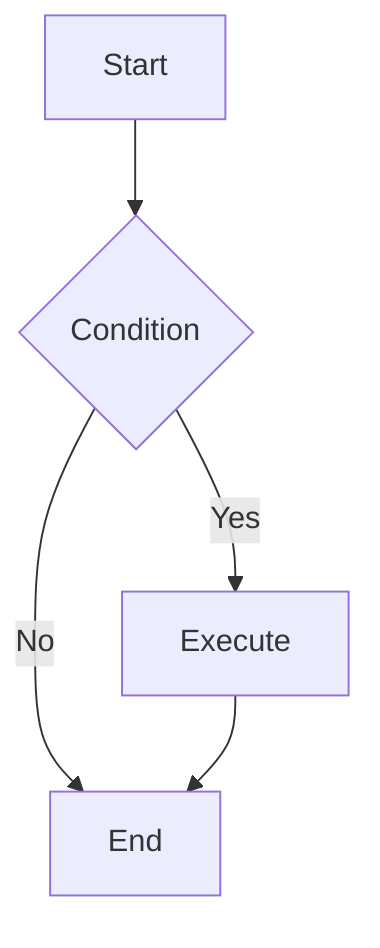

# Obsidian Flavored Markdown Skill

Create and edit valid Obsidian Flavored Markdown. Obsidian extends CommonMark and GFM with wikilinks, embeds, callouts, properties, comments, and other syntax. This skill covers only Obsidian-specific extensions -- standard Markdown (headings, bold, italic, lists, quotes, code blocks, tables) is assumed knowledge.

## Workflow: Creating an Obsidian Note

1. **Write content** using standard Markdown for structure, plus Obsidian-specific syntax below.
2. **Link related notes** using wikilinks (`[[Note]]`) for internal vault connections, or standard Markdown links for external URLs.

## Internal Links (Wikilinks)

```markdown
[[Note Name]]                          Link to note
[[Note Name|Display Text]]             Custom display text
[[Note Name#Heading]]                  Link to heading
[[Note Name#^block-id]]                Link to block
[[#Heading in same note]]              Same-note heading link
```

## Diagrams
If asked to create diagrams use mermaid format
e.g a simple flowchart:



## Workflow when writing a new note
After writing a new note you need to modify note "index" and put a wikilink to the newly created note with a brief description
